## (Macro)Ecologia (Macro)evolutiva: algumas questões

## Filogenia como fonte de "confusão""

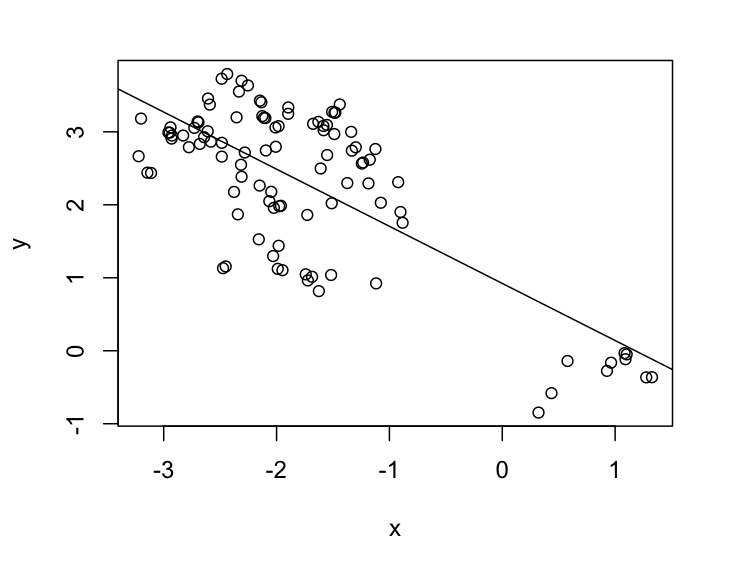{fig-align="center" width="100%"}

## Filogenia como fonte de "confusão""

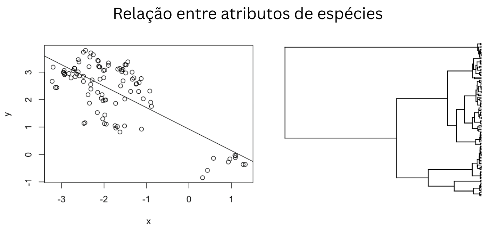{fig-align="center" width="100%"}

## Filogenias como "proxy" de **padrões** e processos

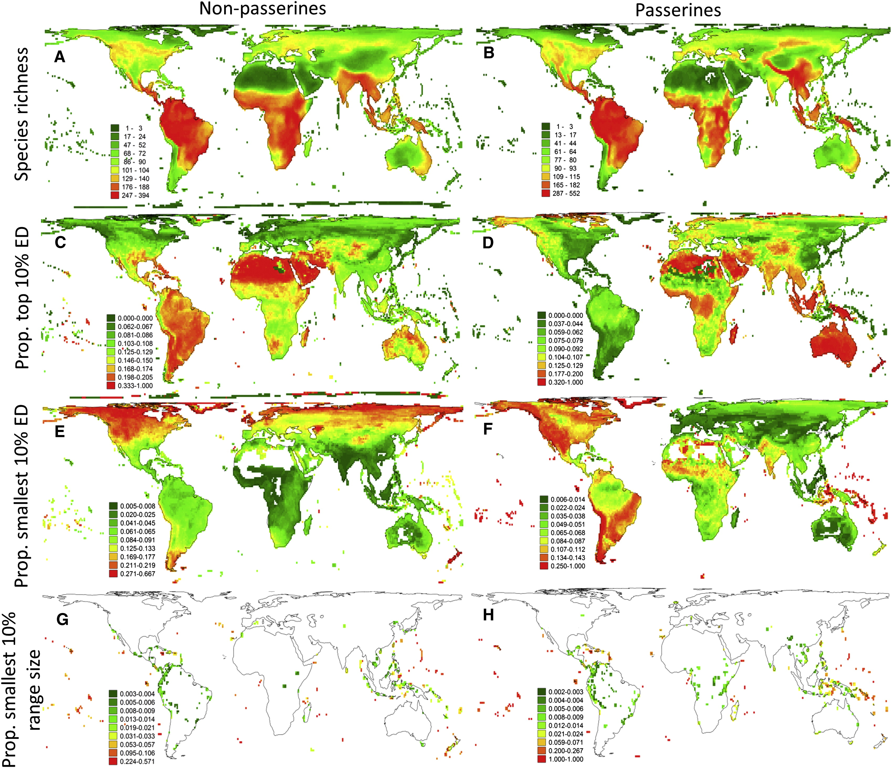{fig-align="center" width="80%"}

## Filogenias como "proxy" de padrões e **processos**

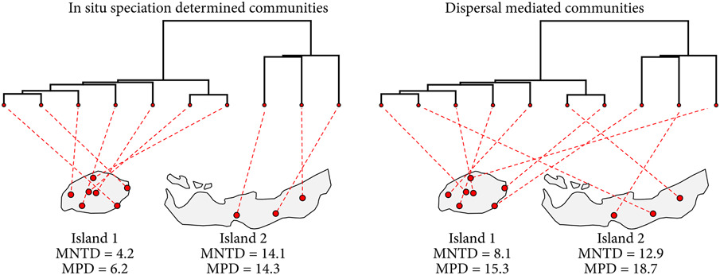{fig-align="center" width="100%"}

## Filogenias como fonte de informação de processos históricos

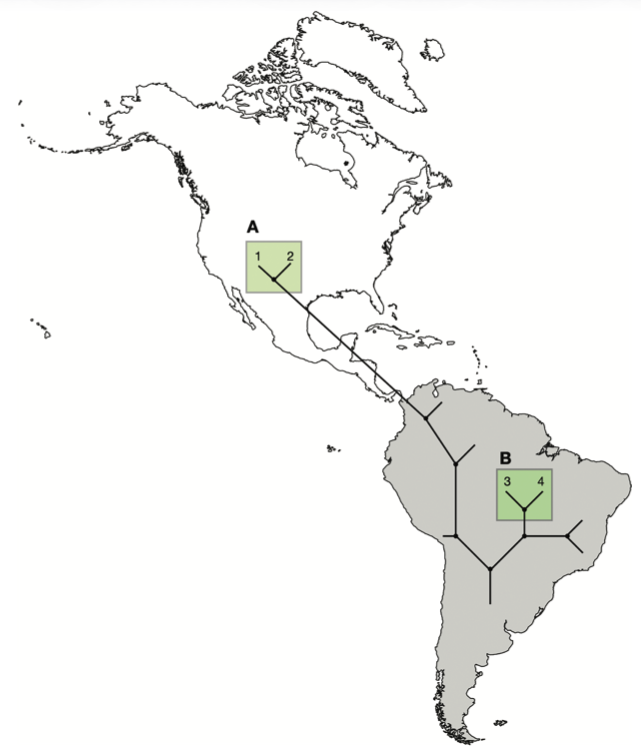{fig-align="center" width="100%"}

## Tentativa de compreender o passado

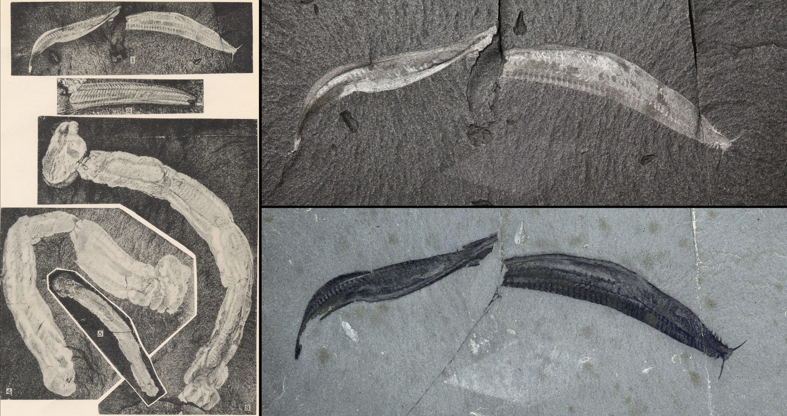{fig-align="center" width="100%"}

## Tentativa de compreender o passado

{fig-align="center" width="100%"}

## Ferramentas de inferência para entender o passado (um pequeno parênteses)

## Uma brevíssima explicação sobre likelihood

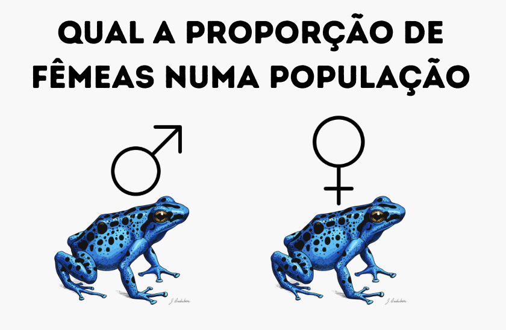{fig-align="center" width="100%"}

## Uma brevíssima explicação sobre likelihood

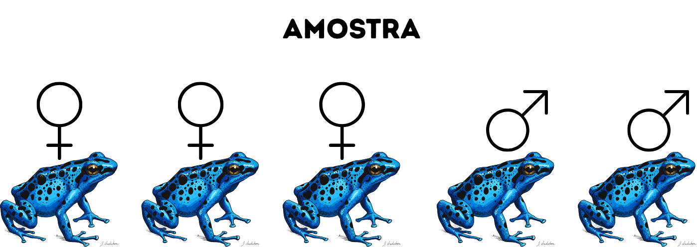{fig-align="center" width="100%"}

## Uma brevíssima explicação sobre likelihood

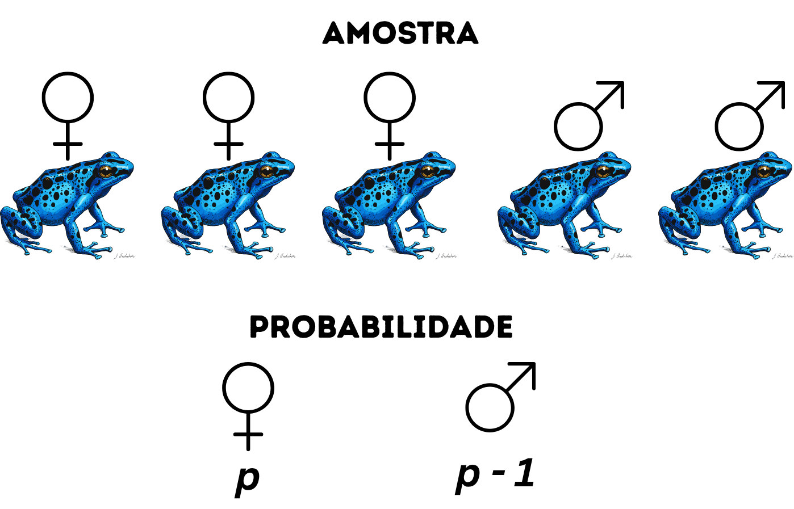{fig-align="center" width="100%"}

## Uma brevíssima explicação sobre likelihood

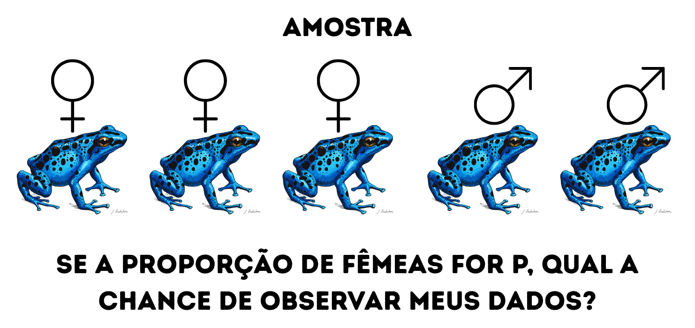{fig-align="center" width="100%"}

## Uma brevíssima explicação sobre likelihood

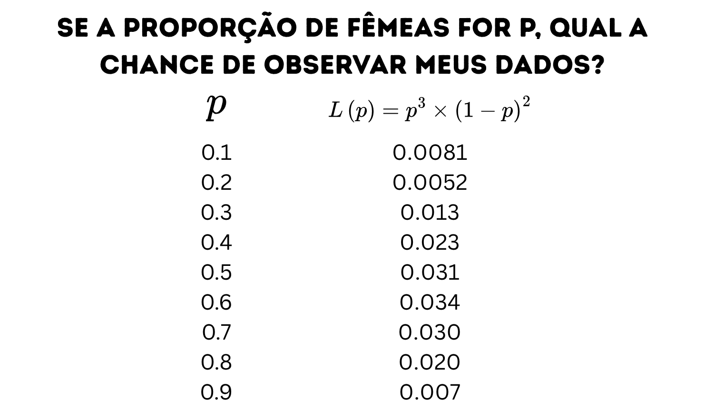{fig-align="center" width="100%"}

## Uma brevíssima explicação sobre likelihood

{fig-align="center" width="100%"}

## Uma brevíssima explicação sobre likelihood

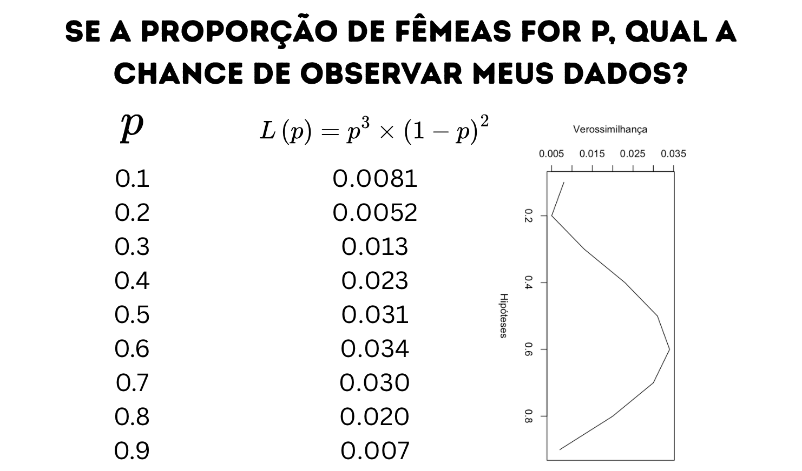{fig-align="center" width="100%"}

## Uma brevíssima explicação sobre likelihood

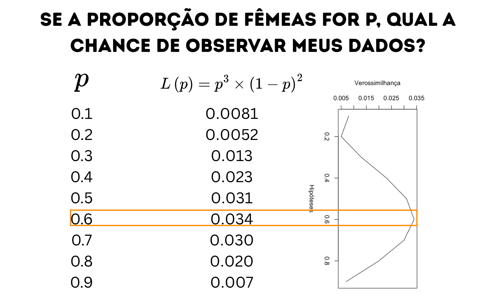{fig-align="center" width="100%"}

