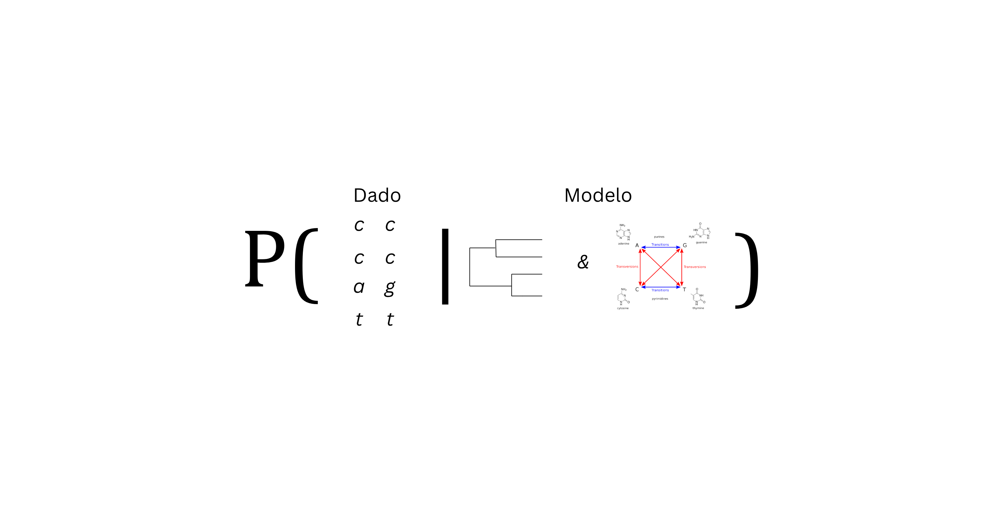

## Arvores filogenéticas: O que são?

::: {layout-align="center"}
{width="100%"}
:::

## Árvores filogenéticas: o que são?

:::: {.columns}

::: {.column width="35%"}

{width=100%}

:::

::: {.column width="65%"}

> "I think
>
> Case must be that one generation then should be as many living as now. To do this & to have many species in same genus (as is) requires extinction.
>
> Thus between A & B immense gap of relation. C & B the finest gradation, B & D rather greater distinction. Thus genera would be formed—bearing relation to ancient types with several extinct forms…"
>
> — **Charles Darwin**, *Caderno de anotações B* (1837)

:::

::::

## Árvores filogenéticas: o que são?

:::: {.columns}

::: {.column width="35%"}

{width=80%}

:::

::: {.column width="65%"}

> "I think
>
> Case must be that one generation then should be as many living as now. To do this & to have many species in same genus (as is) requires extinction.
>
> Thus between A & B immense gap of relation. C & B the finest gradation, B & D rather greater distinction. Thus genera would be formed—bearing relation to ancient types with several extinct forms…"
>
> — **Charles Darwin**, *Caderno de anotações B* (1837)
:::

::::

## Árvores filogenéticas: o que são?

:::: {.columns}

::: {.column width="35%"}

{width=100%}

{width=90%}

:::

::: {.column width="65%"}

> "Wealth of species in the context of evolution."
>
> — **Ernst Haeckel**, *General Morphology of Organisms* (1866)

:::

::::

## Árvores filogenéticas: como surgem?

{fig-align="center" width="100%"}

## Árvores filogenéticas: como surgem?

{fig-align="center" width="100%"}

## Árvores filogenéticas: como surgem? 

{fig-align="center" width="100%"}

## Árvores filogenéticas: como surgem (Modelo)?

{fig-align="center" width="100%"}

## Árvores filogenéticas: como surgem (Modelo)?

{fig-align="center" width="100%"}

## Árvores filogenéticas: como surgem (Modelo)?

{fig-align="center" width="100%"}

## Árvores filogenéticas: como surgem (Modelo)?

{fig-align="center" width="100%"}

## Árvores filogenéticas: como surgem?

{fig-align="center" width="100%"}

## Árvores filogenéticas: como surgem?

{fig-align="center" width="100%"}

## Árvores filogenéticas: como surgem?

{fig-align="center" width="80%"}

## Árvores filogenéticas: como surgem?

{fig-align="center" width="80%"}

## Árvores filogenéticas: como surgem?

{fig-align="center" width="90%"}

## Árvores filogenéticas: como surgem?

{fig-align="center" width="80%"}

## Árvores filogenéticas: como surgem?

{fig-align="center" width="80%"}

## Árvores filogenéticas: como surgem?

{fig-align="center" width="80%"}

## Árvores filogenéticas: como surgem?
:::: {.columns}

::: {.column}
{fig-align="center" width="100%"}
:::
::::
## Anatomia das árvores filogenéticas: como descrever?

Toda árvore bifurcada com n tips (pontas) vai apresentar as seguintes 
    características

::: {.incremental}

1. O número de nós é $n-1$
2. O número total de nós é $2n-1$
3. Cada tip tem um único ramo
4. O único nó que não aprensenta um ramo "parental" é o nó **raiz**

:::
## Como surgem? Por que árvores filogenéticas são **sempre** uma hipótese? {background-image="images/ordenar_monstros.png" background-size="cover" background-position="center"}

## Como surgem? Por que árvores filogenéticas são **sempre** uma hipótese? {background-image="images/ordenar_monstros.png" background-size="cover" background-position="center"}

$$
N_r = (2n - 3)!!
$$

## Como surgem? Por que árvores filogenéticas são **sempre** uma hipótese? {background-image="images/ordenar_monstros.png" background-size="cover" background-position="center"}

$$
N_r = (2n - 3)!! = 15
$$

## Por que árvores filogenéticas são **sempre** uma hipótese? 

| Espécies (\(n\)) | Árvores enraizadas (\(N_r\)) |
|:---:|---:|
| 10  | 34.459.425 |
| 20  | 8.200.794.532.637.891.559.375 |
| 30  | \(4,95 \times 10^{38}\) |
| 50  | \(2,75 \times 10^{76}\) |
| 100 | \(3,35 \times 10^{184}\) |

$$
N_r = (2n-3)!!
$$

## Como surgem? {background-image="images/tree5.png" background-size="cover" background-position="center"}

## Como surgem? Likelihood {background-image="images/ML_tree.png" background-size="cover" background-position="center"}

## Como surgem? Likelihood {background-image="images/ML_tree1.png" background-size="cover" background-position="center"}

## Como surgem? Likelihood {background-image="images/ML_tree2.png" background-size="cover" background-position="center"}

## A anatomia de uma árvore filogenética?

### Qual a diferença entre essas arvores 

<!-- figura com árvores em diferentes formatos aqui mas com a mesma topologia -->

## Tipos de árvore

## Formatos operacionais 

::: {.columns}

::: {.column width="50%"}
### Principais formatos

* Newick
* Tópico explicativo 2

:::

::: {.column width="50%"}
### Traduzindo para o formato

<textarea style="width: 100%; height: 350px; font-size: 1rem; padding: 10px; border-radius: 5px; border: 1px solid #ccc;" placeholder="Digite suas anotações aqui durante a apresentação..."></textarea>
:::

:::

## Árvores filogenéticas: mini quiz

<iframe src="https://klash.shinyapps.io/tree_thinking/" width="100%" height="500px" style="border: 1px solid #ccc; border-radius: 8px;"></iframe>

## Árvores filogenéticas: onde vivem?

