## Relação entre atributos

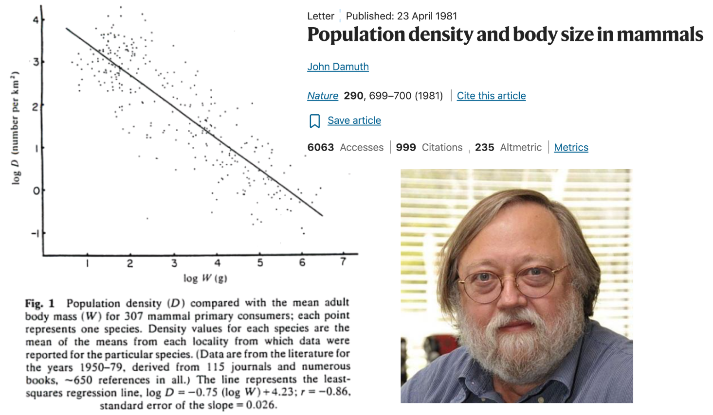{width="100%"}

## Relação entre atributos

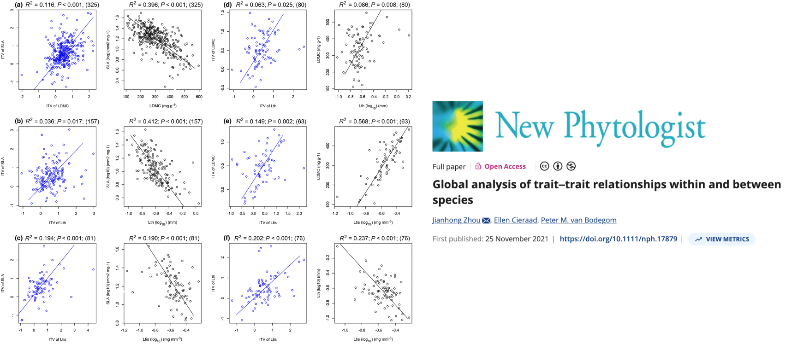{width="100%"}

## Relação entre atributos - o que queremos encontrar?

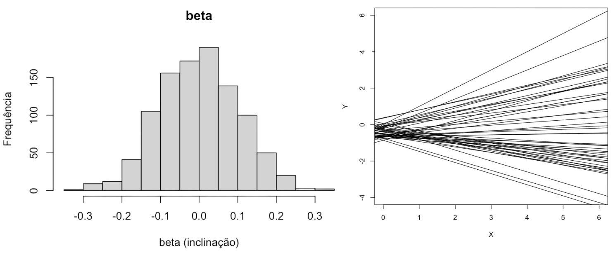{width="100%"}

## Relação entre atributos - o que queremos evitar?

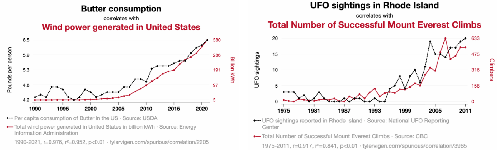{width="100%"}

## Relação entre atributos 

### Dois atributos independentes e randômicos $N(\mu = 0, \sigma = 0.14)$

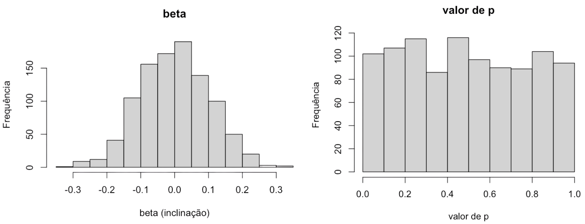{width="100%"}

## Relação entre atributos 

### Dois atributos independentes com $N(\mu = 0, \sigma = 0.14)$, porém....

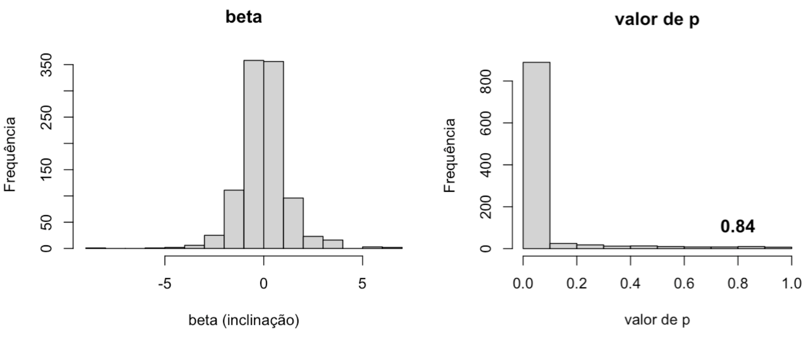{width="100%"}

## Relação entre atributos 

### Dois atributos independentes com $N(\mu = 0, \sigma = 0.14)$, porém....

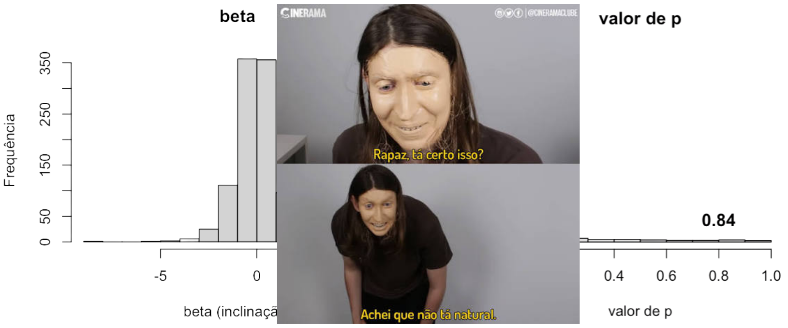{width="100%"}

## Será que estamos corretos? {background-iframe="https://seu-usuario.shinyapps.io/nome-do-seu-app/" background-iframe-style="transform: scale(0.75); transform-origin: top left; width: 133%; height: 133%; border: none;"}

<iframe src="https://gabrielnakamura.shinyapps.io/brownian_motion_explained/" width="100%" height="1100px" style="border: 1px solid #eee; border-radius: 8px;"></iframe>

## Devemos nos preocupar? Sim

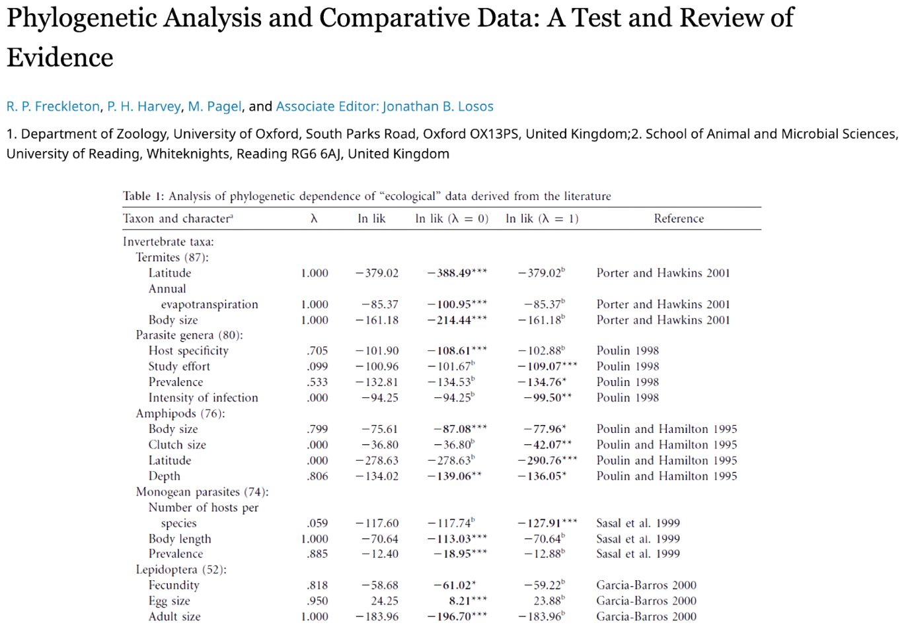{width="100%"}

## Como não chegar a conclusões erradas?

1. Avaliar o nível do sinal filogenético

2. Controlar a autocorrelação filogenética (PIC, métodos baseados em matrizes de 
   covariância filogenética, autovetores filogenéticos)
   
## Métricas de sinal filogenético (avaliando nível do sinal)

- Estatística K ([Bloomberg et al. 2003](https://ichthyology.usm.edu/courses/multivariate/Bloomberg_et_al_2003.pdf),
    Adams et al 2014)
    
- Lambda ($\lambda$) de Pagel (Pagel 1999)

- Curva PVR ([Diniz-Filho et al 1998](https://academic.oup.com/evolut/article-abstract/52/5/1247/6757539?__cf_chl_f_tk=G1DfBoM.x5.ne5Kj4g_Okn73DmfeD2WV3Veb.4vnSZY-1783261129-1.0.1.1-L3mirmWFRs9HXPGT4uEa8WSKVqzPHSac5rjJtGtquT0))

## Métricas de sinal filogenético (avaliando nível do sinal)

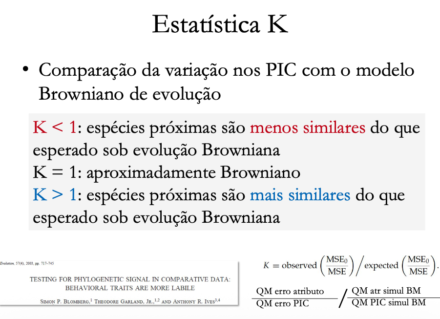{width="100%"}

## Métricas de sinal filogenético (avaliando nível do sinal)

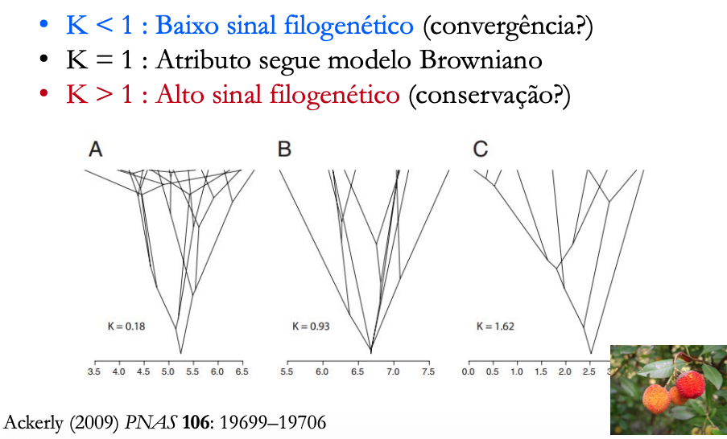{width="100%"}

## Métricas de sinal filogenético (avaliando nível do sinal)

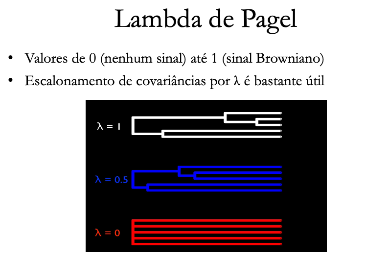{width="100%"}

## Controlando a autocorrelação filogenética

- Calculando "novos" atributos independentes (PIC)

- Incluindo a variação filogenética no modelo (retirando do termo de erro - PVR)

- Modelando o erro de maneira a considerar corretamente a covariância 
   filogenética (PGLS, GLS)

## Relação entre atributos e gradientes ambientais em comunidades

