## Classificação de métricas de diversidade

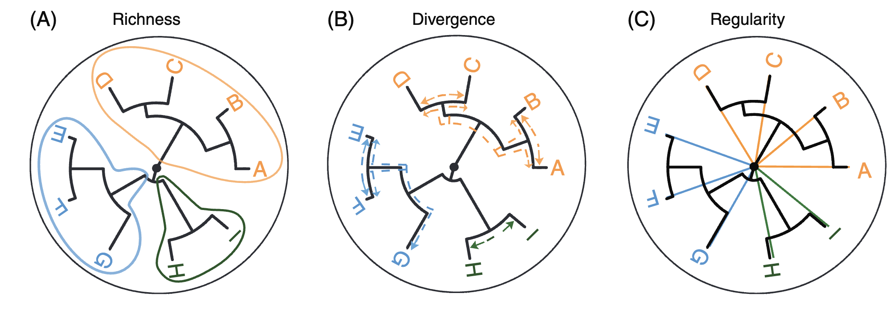{width="100%" fig-align="center"}

## Métricas de riqueza

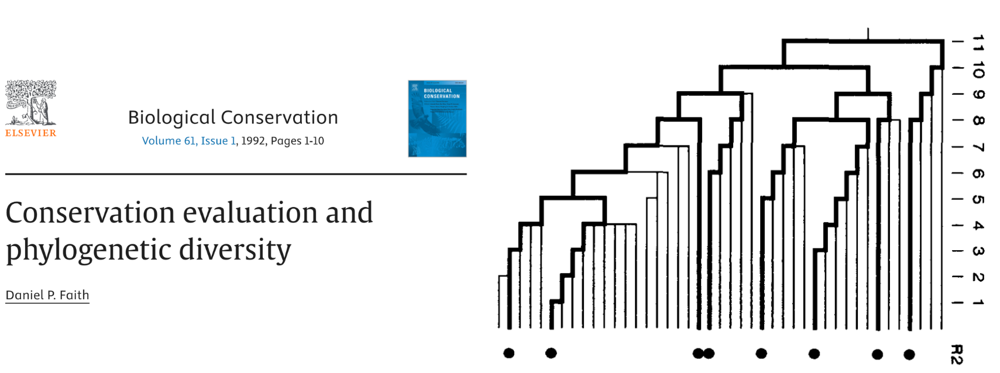{width="100%" fig-align="center"}

## Métricas de riqueza - aplicações

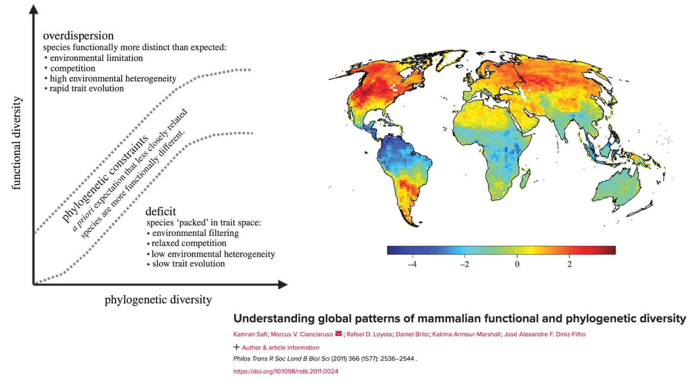{width="100%" fig-align="center"}

## Métricas de riqueza - aplicações

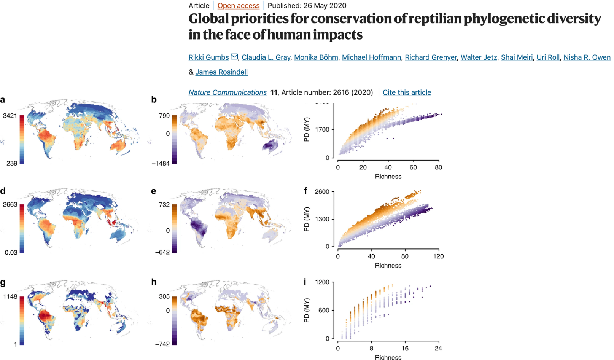{width="100%" fig-align="center"}

## Métricas de divergência

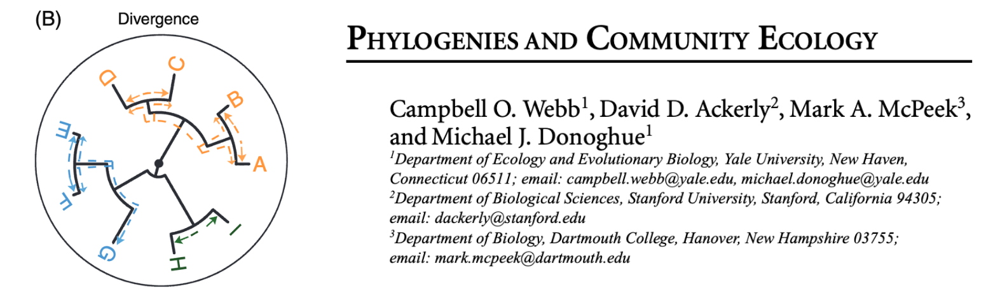{width="100%" fig-align="center"}

## Métricas de divergência

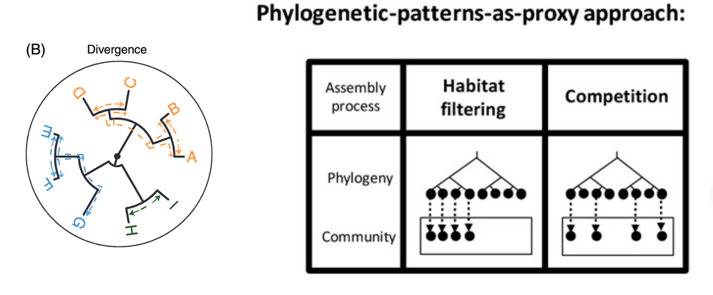{width="100%" fig-align="center"}

## Métricas de divergência (entre comunidades) - filogenia como causa

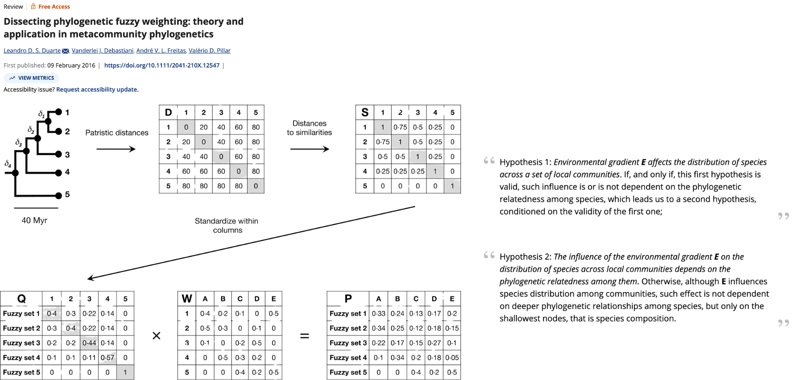{width="100%" fig-align="center"}

## Métricas de divergência (entre comunidades) - aplicações

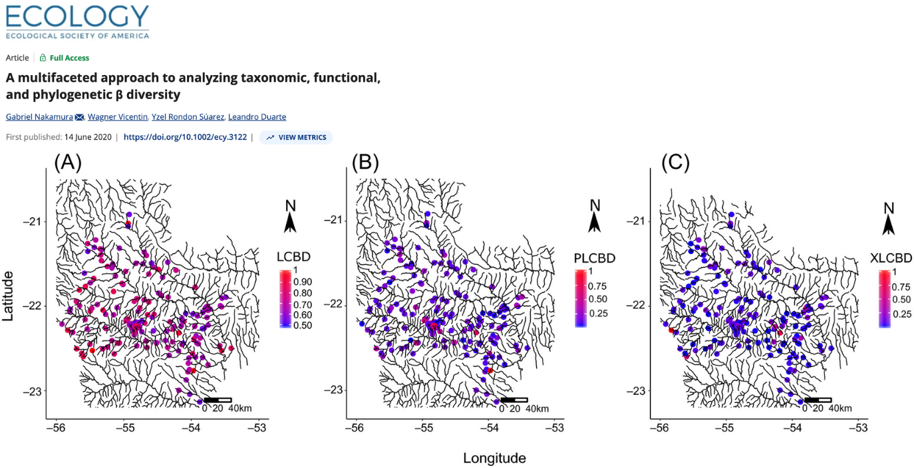{width="100%" fig-align="center"}

## Métricas de divergência (entre comunidades) - biogeografia

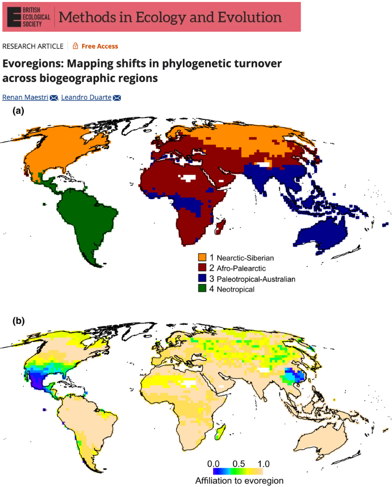{width="100%" fig-align="center"}

## Métricas de divergência - aplicações

{width="100%" fig-align="center"}

## Métricas como indicadores de processos históricos

{width="100%" fig-align="center"}

## Métricas de diversificação

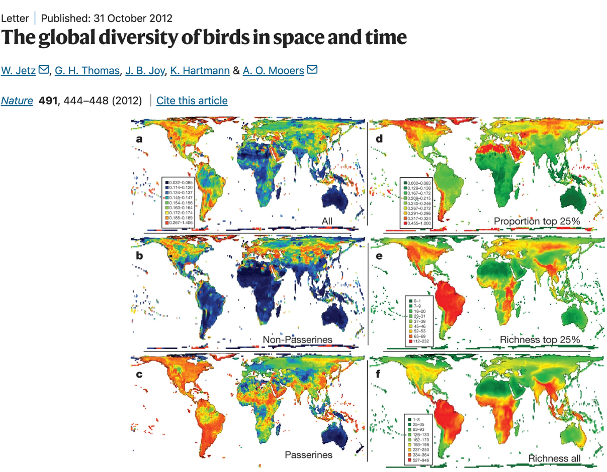{width="100%" fig-align="center"}

## Métricas de diversificação

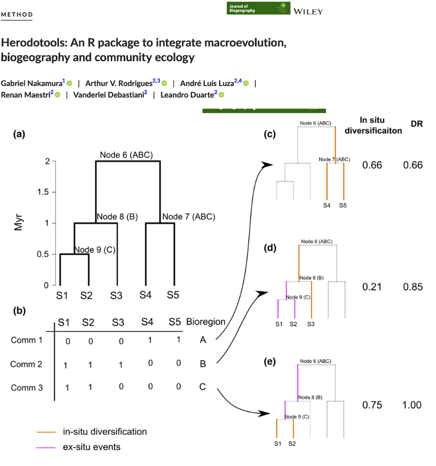{width="100%" fig-align="center"}

## Métricas de diversificação - aplicações

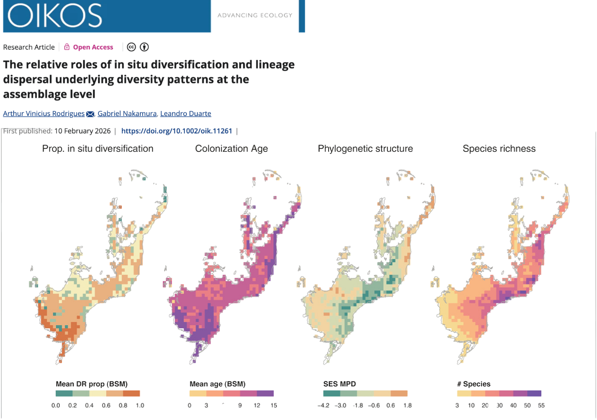{width="100%" fig-align="center"}

## Métricas de regularidade

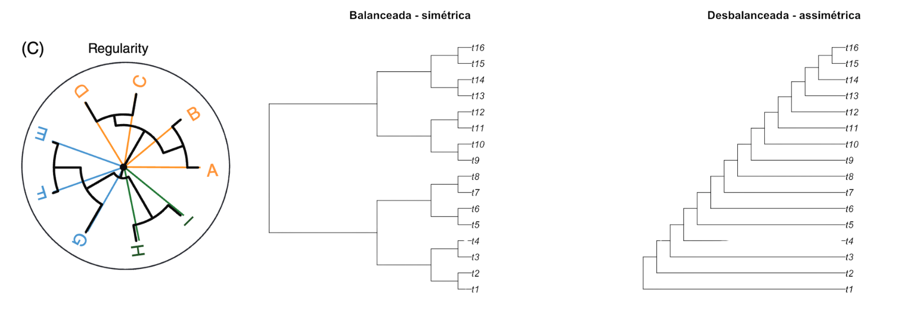{width="100%" fig-align="center"}